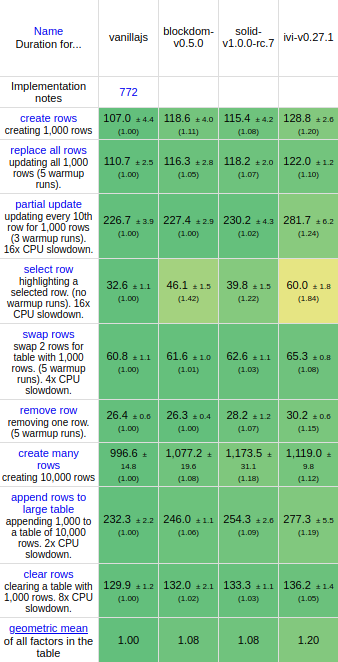

# blockdom

A very fast virtual dom library

- [Introduction](#introduction)
- [Example](#example)
- [Reference](#reference)
  - [Reactive System](#reactive-system)
- [Performance Notes](#performance-notes)
- [About this project](#about-this-project)
- [Credits](#credits)

## Introduction

`blockdom` is a fast virtual dom library. Its main selling point is
that it does not work at the granularity of a single html element, but instead,
it works with `blocks`: html elements, with arbitrary content.

So, instead of doing something like `h('div', {}, [...some children])`, we can
work in blockdom with a larger unit of dom. For example:

```js
// create block types
const block = createBlock(`<div class="some-class"><p>hello</p><blockdom-child-0/></div>`);
const subBlock = createBlock(`<span>some value: <blockdom-text-0/></span>`);

// create a blockdom virtual tree
const tree = block([], [subBlock(["blockdom"])]);

// mount the tree
mount(tree, document.body);

// result:
// <div class="some-class"><p>hello</p><span>some value: blockdom</span></div>
```

As a result, `blockdom` can use the internal `cloneNode(true)` method to quickly
create dom elements in one call instead of many, and the diff process is much
faster, since it has to process less virtual nodes. Here is a benchmark run,
comparing the performance of a handcrafted vanilla js implementation against
`blockdom`, `solid` (incredibly fast fine-grained reactive framework) and `ivi` (the fastest
virtual dom implementation).



`blockdom` can update the dom, manage event handlers, support fragments (multi-root elements).
It is however not a fully featured framework. Its goal is being a compilation target
for templates in a higher level framework. For some frameworks, it is useful to
have a rendering process in two separate phases: the render phase (creating the virtual
dom representation) and the commit phase (applying it to the DOM).

## Example

Here is a more interesting example. It is a dynamic list of counters, featuring
handlers, lists and dynamic content:

```js
const counterBlock = createBlock(`
    <div class="counter">
        <button block-handler-1="click">Increment</button>
        <span>Value: <block-text-0/></span>
    </div>`);

const mainBlock = createBlock(`
    <div>
        <div><button block-handler-0="click">Add a counter</button></div>
        <div><block-child-0/></div>
    </div>`);

const state = [{ id: 0, value: 3 }];

function addCounter() {
  state.push({ value: 0, id: state.length });
  update();
}

function incrementCounter(id) {
  const counter = state.find((c) => c.id === id);
  counter.value++;
  update();
}

function render(state) {
  const counters = state.map((c) => {
    const handler = [incrementCounter, c.id];
    return Object.assign(counterBlock([c.value, handler]), { key: c.id });
  });
  return mainBlock([addCounter], [list(counters)]);
}

let tree = render(state);
mount(tree, document.body);

function update() {
  patch(tree, render(state));
}
```

Notice that block types are first created, with special attributes or tags such as
`<block-text-0 />` or `block-handler-1="click"`. What happens is that `blockdom`
then process the block template, find all these special tags/attributes and generate
fast functions that will create and/or update these values.

The `examples` folder contains the complete code for this example.

## Reference

`blockdom` api is quite small: 6 function to create vnodes, 3 functions to manipulate
vdom trees and one configuration object.

First, let us talk about the various vnode types:

| Name      | Purpose                                                                                |
| --------- | -------------------------------------------------------------------------------------- |
| `block`   | a representation of an html element (with children/attributes)                         |
| `multi`   | a representation of a static list of vnodes (possibly undefined or of different types) |
| `list`    | a dynamic list of vnodes (which have all the same type)                                |
| `text`    | a simple vnode representing a text node                                                |
| `toggler` | a container node that allows switching dynamically between different type of subnodes  |
| `html`    | represent an arbitrary html content                                                    |

### Creating vnodes

###### Blocks

The most important vnode type is a block. Since each block is actually unique,
we need to first generate a block builder function:

```js
const block = createBlock(`<div>hello blockdom</div>`);
```

The `createBlock` function takes a string and return a function that builds the
corresponding block:

```js
const tree = block(); // now tree is a vnode that can be mounted/patched
```

So, in a sense, `createBlock` is a kind of factory. It creates a function that
will generate the final vnode. The function `createBlock` takes two optional
arguments: `data` (list of values) and `children` (list of vnodes).

The values given in `data` are used to set/update dynamic content (text, attributes,
handlers or refs). The vnodes in `children` correspond to sub blocks.

Text content is simply added by using a special tag `block-text-{index}`:

```js
const block = createBlock(`<div><p><block-text-0/></p><p><block-text-1/></p></div>`);
```

Notice the suffix `0` and `1`: all content nodes/attributes have to be indexed,
starting at 0. Then, we can provide the corresponding values in the `data` array,
given in argument:

```js
const tree = block(["hello", "blockdom"]);
```

This tree now represents `<div><p>hello</p><p>blockdom</p></div>`

Block attributes are defined with an attribute: `block-attribute-{index}`:

```js
const block = createBlock(`<div block-attribute-0="hello"></div>`);
const tree = block(["world"]); // correspond to <div hello="world"></div>
```

Note that attribute here is given a broad meaning: class and styles are considered
attributes (but they will use specialized code to properly manage them), and also
some special tags have properties (for example, the `checked` property on an input).
These properties are also properly handled, even though they are defined as
attribute.

Event handlers can be added with the `block-handler-{index}` attribute:

```js
const block = createBlock(`<div block-handler-0="click"></div>`);
const tree = block([someFunction]);
```

By default, `blockdom` support two variations: the given data can be a function
(in that case, it will be called with the event as argument), or it can be a pair
`[fn, value]`, in which case, the function `fn` will be called with `value, event`
as arguments.

Note that this behaviour can be customized (see the section about configuration).
Also, `blockdom` has a synthetic event system: this means that it does not
really attach an event handler for each handler in each block. It just binds a
simple global event handler on `document.body` for each event type, and will
properly call the corresponding handlers when necessary.

Finally, blocks can define a reference with the `block-ref={index}` attribute.
In this case, the provided data should be a function:

```js
const block = createBlock(`<div><p block-ref=0="click">hey</p></div>`);
const tree = block([someFunction]);
```

The function `someFunction` will be called with the htmlelement `<p>` when it is
created, and then later with `null` when it is removed from the dom.

###### multi

The multi block is useful when we deal with a fixed number of vnodes. For example,
a template with multiple consecutive elements. Also, some or all of its vnodes
can be undefined. This is useful when there is some condition for a child to be
present. If a child is undefined, the multi vnode will replace it by an empty
text node.

```js
const block1 = createBlock(`<div>1</div>`);
const block2 = createBlock(`<div>2</div>`);

const tree = multi([block1, block2]); // represents `<div>1</div><div>2</div>`
const otherTree = multi([block1, undefined]); // represents `<div>1</div>`
```

Each children can be a mix of any type.

###### list

A `list` vnode represents a dynamic collection of vnodes, all of them with the
same type. Each of these nodes need to have a key to properly reconcile them.
Here is an example:

```js
const data = [
  { id: 1, text: "apple" },
  { id: 2, text: "pear" },
];
const block = createBlock(`<p><block-text-0/></p>`);

const items = data.map((item) => withKey(block([item.text]), item.id));
const tree = list(items); // represents <p>apple</p><p>pear</p>
```

Note the use of the `withKey` helper.

###### text

Most text are inserted inside a block with `block-text-{index}`. However, in
some cases, it is useful to be able to manipulate directly just a simple text
node:

```js
// represents 3 text nodes: blackyellowred
const tree = multi([text("black"), text("yellow"), text("red")]);
```

###### toggler

As mentioned above, `blockdom` need each vnode in a patch operation to be of the
same exact type. However, it is not always known before hand what the concrete
type of the vnode will be. For example, if we implement sub templates (partials)
in a template language. The call site does not know what the result of an
arbitrary template render will be. In that case, we need the `toggler` vnode
to dispatch between different type of vnodes:

```js
const block = createBlock("<p>hey</p>");

const tree1 = toggler("key1", text("foo")); // represent a text node with foo
const tree2 = toggler("key2", block()); // represent <p>hey</p>
```

The `toggler` function takes a `key` as first argument, and a vnode as second.
When it is patched, it compares the values of the keys: if they are the same,
it will simply patch the child vnode. If they are different, it will remove the
previous one and mount the new vnode in its place.

### Manipulating vnode trees

The 3 functions are:

- `mount(vnode, target)`
- `patch(vnode1, vnode2)`
- `remove(vnode)`

## Performance Notes

`blockdom` is very fast, I believe. If you read this section, you may be interested
in understanding _why_. Well, to be honest, I am not really sure. I spent hours
running benchmarks, and even now, I am not really sure about what exactly makes
some code fast or not.

Here is what I can tell, though:

- working at a block level instead of a single html element is a huge speedup,
  obviously. This is the main selling point of this library.
- browsers are pretty good at inlining functions, so it's mostly pointless to
  try to manually complicate code by inlining small functions.
- synthetic events is a small speed increase (around 1% on the main benchmark).
- I could not find any noticeable difference by using smaller objects/shorter
  key names
- however, for some reason, the implementation got a pretty big speedup once I
  started using classes. I am not certain why, but I guess that browsers are
  pretty good at optimizing class construction. It feels like it is faster than
  creating directly an object: I tried implementing vnodes with objects such as

  ```js
      return {
          mount: mountFunction,
          patch: patchFunction,
          moveBefore: moveBeforeFunction,
          ...,
          data: ...,
          children: ...
      }
  ```

  and it was noticeably slower. I assume that it is because each object takes
  more memory, since they need to keep a pointer to each vnode function.

  An alternative was grouping all such objects in a sub key:

  ```js
      return {
          impl: implementationObject // contains mount/patch/moveBefore/...
          data: ...,
          children: ...
      }
  ```

  but it was also slower (probably because the code had to perform a lookup
  everytime).

  Another alternative using `Object.create(implementationObject)` failed. So,
  the big takeway from this is that maybe, using classes is good for performance in some hot paths.

- one of the first implementation tried to build fast code by creating a new
  customized function with `new Function`, for each block. It was really fast,
  but actually not really noticeably faster than simply trying to setup a fast
  create/update path and using closures to _compile_ a block. This has also
  the advantage of not using `new Function` (which is disallowed in some
  environments), and is cheaper, memory wise.

- another interesting point: I believe some of the speed of this vdom comes from
  the fact that it has a pretty big constraint: a vdom tree is supposed to be
  patched with a vdom tree of the same shape. This comes naturally if we compile
  a template into a function (the template has always the same structure). This
  constraint means that the underlying code does not have to check the type or the
  keys in most cases. It knows that it is patched with a block of the same type.

- Also: there is probably some room to make it faster. First, I am not smart
  enough to understand everything that was done in `ivi`, so there may be some
  nice ideas that I did not apply. Also, the reconciliation algorithm is probably
  not the most performant, since I just adapted a quite naive version. Another
  possible improvement is removing the need to keep a reference to the parent
  node. If it can be done, this should reduce memory use. If you have any other
  ideas, I am very interested in hearing about them!

## About this project

In this section, you will find answers to some questions you may have about this
project.

- _Is this virtual dom used in an actual project?_ Not yet ready, but it is used
  in the current work on Owl version 2. The Owl framework 1.x (github.com/odoo/owl)
  is based on a fork of snabbdom, and as such, does not support fragment. The
  version 2 is not ready yet, but will be based on `blockdom`.

- _This is not a virtual dom, is it?_ Yes it is. Well, it depends what you mean
  by a virtual dom. It is not a representation of the dom tree element by element,
  but it still is a complete representation of what the dom is looking like. So,
  yes, `blockdom` is a virtual dom.

- _Why would you need a virtual dom, in the first place?_ It depends on your
  needs. Clearly, some frameworks can do very well by using other strategies.
  However, some other frameworks (such as React and owl with their concurrent mode)
  need the ability to split the rendering process in two phases, so we can
  choose to commit a rendering (or not if for some reason it is no longer useful).
  In that case, I do not see how to proceed without a virtual dom.

## Credits

`blockdom` is inspired by many frameworks: snabbdom, then solid, ivi, stage0 and
1more. The people behind these projects are incredible.
