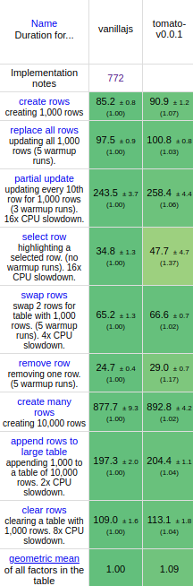

# Conclusion

Quick links: [start](readme.md) - [part 1](part1.md) - [part 2](part2.md) - [part 3](part3.md) - [part 4](part4.md) - [part 5](part5.md) - [part 6](part6.md) - **conclusion**

The `tomato` framework has a very small API:

- `render` (main entry point, mount a component in the DOM),
- `html` (the template function),
- `useState` (reactivity),
- `useEffect` (effects),
- `component` (to define a component virtual node),
- `createIterator` (to define iterators, for efficiently processing lists).

<details>
  <summary>Final code for the tomato framework (<i>click to expand</i>)</summary>
  <!-- have to be followed by an empty line! -->

```js
// Component
let currentVNode = null;

class VComponent {
  constructor(C, props) {
    this.C = C;
    this.instance = null;
    this.props = props;
    this.isDestroyed = false;
    this.isParent = false;
    this.effects = [];
  }

  mount(parent, afterNode) {
    currentVNode = this;
    this.instance = this.C();
    this.node = this.instance(this.props);
    this.node.mount(parent, afterNode);
    this.isParent = currentVNode !== this;
  }

  moveBefore(other, afterNode) {
    this.node.moveBefore(other ? other.node : null, afterNode);
  }

  patch() {
    if (!this.isDestroyed) {
      let current = currentVNode;
      let dirtyEffects = this.effects.filter((e) => e.checkDirty());
      this.node.patch(this.instance(this.props), this.isParent);
      for (let effect of dirtyEffects) {
        effect.perform();
      }
      this.isParent = this.isParent || current === currentVNode;
    }
  }

  beforeRemove() {
    for (let effect of this.effects) {
      effect.cleanup();
    }
    this.node.beforeRemove();
    this.isDestroyed = true;
  }

  remove() {
    this.node.remove();
  }

  firstNode() {
    return this.node.firstNode();
  }
}

function component(C, props) {
  return new VComponent(C, props);
}

// render function

function render(Comp, target) {
  let vnode = new VComponent(Comp);
  vnode.mount(target);
}

// html tagged template

let cache = new WeakMap();

function html(strings, ...args) {
  let template = cache.get(strings);
  if (!template) {
    template = compileTemplate(strings, args);
    cache.set(strings, template);
  }
  return template(args);
}

// template compiler

function compileTemplate(strings, args) {
  let dataIdx = [];
  let childrenIdx = [];
  let blockDescription = strings
    .map((str, index) => {
      let arg = args[index];
      if (arg !== undefined) {
        if (str.endsWith("=")) {
          // either a handler, a ref or an attribute
          let i = dataIdx.push(index) - 1;
          let match = str.match(/\b(\w+)=$/);
          let prefix = str.slice(0, -match[0].length);
          if (match[1].startsWith("on")) {
            let event = match[1].slice(2).toLowerCase();
            return `${prefix}block-handler-${i}="${event}"`;
          } else if (match[1] === "ref") {
            return `${prefix}block-ref="${i}"`;
          } else {
            return `${prefix}block-attribute-${i}="${match[1]}"`;
          }
        }
        if (typeof arg === "object" || arg === null) {
          let i = childrenIdx.push(index) - 1;
          return str + `<block-child-${i}/>`;
        } else {
          let i = dataIdx.push(index) - 1;
          return str + `<block-text-${i}/>`;
        }
      }
      return str;
    })
    .join("");
  let block = createBlock(blockDescription);
  return function template(args) {
    let data = dataIdx.map((i) => args[i]);
    let children = childrenIdx.map((i) => args[i]);
    return block(data, children);
  };
}

// scheduler

let pendingRenderings = new Set();

function scheduleRendering(fn) {
  if (!pendingRenderings.size) {
    requestAnimationFrame(() => {
      for (let vnode of pendingRenderings) {
        vnode.patch();
      }
      pendingRenderings.clear();
    });
  }
  pendingRenderings.add(fn);
}

// reactivity

function useState(value) {
  let vnode = currentVNode;

  let state = () => value;
  let setState = (newValue) => {
    value = newValue;
    scheduleRendering(vnode);
  };
  return [state, setState];
}

// effects management

const NO_OP = () => {};

class Effect {
  constructor(effect, depsFn = NO_OP) {
    this.fn = effect;
    this.depsFn = depsFn;
    this.deps = this.depsFn() || [];
    this.perform();
  }
  checkDirty() {
    let deps = this.deps;
    let newDeps = this.depsFn() || [];
    const isDirty = newDeps.some((val, i) => val !== deps[i]);
    if (isDirty) {
      this.deps = newDeps;
      this.cleanup();
    }
    return isDirty;
  }
  perform() {
    this.cleanup = this.fn() || NO_OP;
  }
}

function useEffect(effect, depsFn) {
  currentVNode.effects.push(new Effect(effect, depsFn));
}

// iterators

function createIterator(key, elemFn, depsFn) {
  if (!depsFn) {
    return function iterate(elems) {
      return list(
        elems.map((elem) => {
          let node = elemFn(elem);
          node.key = elem[key];
          return node;
        })
      );
    };
  }
  let cache = {};

  return function iterate(elems) {
    let nextCache = {};
    let result = list(
      elems.map((elem) => {
        let cacheKey = elem[key];
        let deps = depsFn(elem);
        let cachedElem = cache[cacheKey];
        if (cachedElem) {
          let cacheDeps = cachedElem.memo;
          let isSame = true;
          for (let i = 0, l = cacheDeps.length; i < l; i++) {
            if (deps[i] !== cacheDeps[i]) {
              isSame = false;
              break;
            }
          }
          if (isSame) {
            nextCache[cacheKey] = cachedElem;
            return cachedElem;
          }
        }
        let node = elemFn(elem);
        node.key = cacheKey;
        node.memo = deps;
        nextCache[cacheKey] = node;
        return node;
      })
    );
    cache = nextCache;
    return result;
  };
}

```

</details>

## Performance

Before we end this tutorial, I wrote some benchmarking code to evaluate the
performance of this toy framework, written with no test and just to have fun.

<details>
  <summary>Benchmark code (based on the javascript framework project) (<i>click to expand</i>)</summary>

```js
// -----------------------------------------------------------------------------
// data stuff
// -----------------------------------------------------------------------------

let idCounter = 1;
const adjectives = [
    "pretty",
    "large",
    "big",
    "small",
    "tall",
    "short",
    "long",
    "handsome",
    "plain",
    "quaint",
    "clean",
    "elegant",
    "easy",
    "angry",
    "crazy",
    "helpful",
    "mushy",
    "odd",
    "unsightly",
    "adorable",
    "important",
    "inexpensive",
    "cheap",
    "expensive",
    "fancy",
  ],
  colours = [
    "red",
    "yellow",
    "blue",
    "green",
    "pink",
    "brown",
    "purple",
    "brown",
    "white",
    "black",
    "orange",
  ],
  nouns = [
    "table",
    "chair",
    "house",
    "bbq",
    "desk",
    "car",
    "pony",
    "cookie",
    "sandwich",
    "burger",
    "pizza",
    "mouse",
    "keyboard",
  ];

function _random(max) {
  return Math.round(Math.random() * 1000) % max;
}

function buildData(count) {
  let data = new Array(count);
  for (let i = 0; i < count; i++) {
    const label = `${adjectives[_random(adjectives.length)]} ${colours[_random(colours.length)]} ${
      nouns[_random(nouns.length)]
    }`;
    data[i] = {
      id: idCounter++,
      label,
    };
  }
  return data;
}

// -----------------------------------------------------------------------------
// Row pure component
// -----------------------------------------------------------------------------

function Row(row, isSelected, selectRow, removeRow) {
  return html` <tr class=${isSelected ? "danger" : ""}>
    <td class="col-md-1">${row.id}</td>
    <td class="col-md-4">
      <a onClick=${() => selectRow(row.id)}>${row.label}</a>
    </td>
    <td class="col-md-1">
      <a onClick=${() => removeRow(row.id)}>
        <span class="glyphicon glyphicon-remove" aria-hidden="true" />
      </a>
    </td>
    <td class="col-md-6" />
  </tr>`;
}

// -----------------------------------------------------------------------------
// Main component
// -----------------------------------------------------------------------------

function Main() {
  let [rows, setRows] = useState([]);
  let [selectedRowId, setSelectedRowId] = useState(null);

  const run = () => {
    setRows(buildData(1000));
    setSelectedRowId(null);
  };
  const runLots = () => {
    setRows(buildData(10000));
    setSelectedRowId(null);
  };
  const add = () => setRows(rows().concat(buildData(1000)));
  const update = () => {
    let rowList = rows();
    let index = 0,
      len = rowList.length;
    while (index < len) {
      rowList[index].label = rowList[index].label + " !!!";
      index += 10;
    }
    setRows(rowList);
  };
  const clear = () => {
    setRows([]);
    setSelectedRowId(null);
  };
  const swapRows = () => {
    let rowList = rows();
    if (rowList.length > 998) {
      let tmp = rowList[1];
      rowList[1] = rowList[998];
      rowList[998] = tmp;
    }
    setRows(rowList);
  };

  let selectRow = (rowId) => setSelectedRowId(rowId);
  let removeRow = (rowId) => {
    const rowList = rows();
    const index = rowList.findIndex((row) => row.id === rowId);
    rowList.splice(index, 1);
    setRows(rowList);
  };

  let iterator = createIterator(
    "id",
    (row) => Row(row, row.id === selectedRowId(), selectRow, removeRow),
    (row) => [row.id === selectedRowId(), row.label]
  );

  return () => html` <div class="container">
    <div class="jumbotron">
      <div class="row">
        <div class="col-md-6">
          <h1>blockdom test keyed</h1>
        </div>
        <div class="col-md-6">
          <div class="row">
            <div class="col-sm-6 smallpad">
              <button type="button" class="btn btn-primary btn-block" id="run" onClick=${run}>
                Create 1,000 rows
              </button>
            </div>
            <div class="col-sm-6 smallpad">
              <button
                type="button"
                class="btn btn-primary btn-block"
                id="runlots"
                onClick=${runLots}
              >
                Create 10,000 rows
              </button>
            </div>
            <div class="col-sm-6 smallpad">
              <button type="button" class="btn btn-primary btn-block" id="add" onClick=${add}>
                Append 1,000 rows
              </button>
            </div>
            <div class="col-sm-6 smallpad">
              <button type="button" class="btn btn-primary btn-block" id="update" onClick=${update}>
                Update every 10th row
              </button>
            </div>
            <div class="col-sm-6 smallpad">
              <button type="button" class="btn btn-primary btn-block" id="clear" onClick=${clear}>
                Clear
              </button>
            </div>
            <div class="col-sm-6 smallpad">
              <button
                type="button"
                class="btn btn-primary btn-block"
                id="swaprows"
                onClick=${swapRows}
              >
                Swap Rows
              </button>
            </div>
          </div>
        </div>
      </div>
    </div>
    <table class="table table-hover table-striped test-data">
      <tbody>
        ${iterator(rows())}
      </tbody>
    </table>
    <span class="preloadicon glyphicon glyphicon-remove" aria-hidden="true" />
  </div>`;
}

render(Main, document.body);
```

</details>

The result can be seen in this screenshot:



It is incredibly good in my opinion: these performance stats are world class!
It is about 4 points slower than pure `blockdom`, but that is to be expected:
we have to pay the price of the abstraction. Note that not much effort was done
to really optimize `tomato`, nor its size.

## Parting notes

We now end our journey into the beautiful world of javascript frameworks. We
produced along the way a working framework, built on top of `blockdom`, that,
in 250-ish lines of code, supports:

- component system
- nice simple API
- reactive with useState
- batch updates in `requestAnimationFrame`
- support effects
- is really fast

Also, working on this project was very pleasant. It looks like template literal
based frameworks have the advantage of being standalone: we can have a pretty
nice project without any compilation step.

Note that this is only a tutorial, so our `tomato` framework is still a toy
framework, compared to real/used in production modern frameworks. For example,
here are some topics that probably could be added/improved:

- more robust scheduling (batch together trees of components, ...)
- state management, batching updates
- asynchronous primitives
- better DX for fragments
- more precise lifecycle (not sure if needed, maybe `useEffect` is enough)
- better reporting for errors in templates
- error management in general
- animations
- bug fixing, making sure effects are triggered at proper time, ...

In the end, it all depends on what kind of features you want out of your framework.
If you have any interesting ideas, don't hesitate to take the code here, improve
it, and maybe make a pull request if you want to share it.

---

Quick links: [start](readme.md) - [part 1](part1.md) - [part 2](part2.md) - [part 3](part3.md) - [part 4](part4.md) - [part 5](part5.md) - [part 6](part6.md) - **conclusion**
