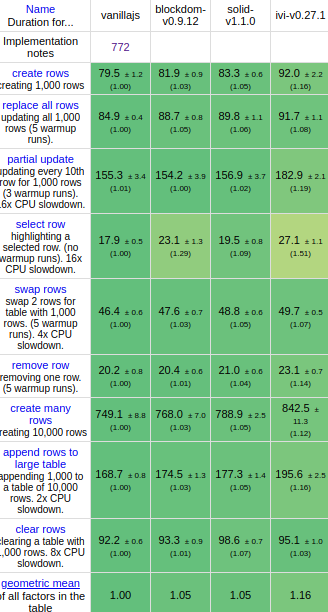

# Performance Notes

With its block-based design, `blockdom` can internally uses `cloneNode(true)`
method to quickly create dom elements in one call instead of many. Also, the
virtual tree is much smaller, which in turns speed up significantly the diff
process.

The [javascript web frameworks benchmark](https://github.com/krausest/js-framework-benchmark)
compares many frameworks on a standardized suite of benchmarks. Here is the
current state of `blockdom` performance, compared to a handcrafted vanilla js
implementation, `solid` (incredibly fast fine-grained reactive framework) and `ivi` (the fastest
virtual dom implementation).



Note that the comparison is not totally fair, since `blockdom` is not really a
framework. A framework built on top of `blockdom` will have some amount of
overhead, depending on the featureset. So, virtual-dom based frameworks will
probably be slightly slower than `solidjs` in this benchmark.

## Why is it fast?

`blockdom` is fast mostly because of a fundamental design choice: we represent
a virtual dom with a tree of blocks (and some other primitive) instead of elements.
This means that:

1. we can use `cloneNode(true)` to quickly create DOM elements
2. the virtual tree is small, so it is faster to diff
3. it uses less memory

There is another design choice that makes it fast: we assume that a virtual
tree is always patched with a virtual tree of the same structure (except for
`toggler` elements).

4. So, the diff process does not have to check if two vnodes are the same type
   at every step of the process

Finally, lots of smaller scale optimizations, such as capturing the reference
to dom manipulation functions instead of looking them up every time.

## Random notes

I spent hours running benchmarks, and even now, I am not really sure about what
exactly makes some code fast or not.

Here is what I can tell, though:

- browsers are pretty good at inlining functions, so it's mostly pointless to
  try to manually complicate code by inlining small functions.
- synthetic events is a small speed increase (around 1% on the main benchmark).
- I could not find any noticeable difference by using smaller objects/shorter
  key names
- however, for some reason, the implementation got a pretty big speedup once I
  started using classes. I am not certain why, but I guess that browsers are
  pretty good at optimizing class construction. It feels like it is faster than
  creating directly an object: I tried implementing vnodes with objects such as

  ```js
      return {
          mount: mountFunction,
          patch: patchFunction,
          moveBefore: moveBeforeFunction,
          ...,
          data: ...,
          children: ...
      }
  ```

  and it was noticeably slower. I assume that it is because each object takes
  more memory, since they need to keep a pointer to each vnode function.

  An alternative was grouping all such objects in a sub key:

  ```js
      return {
          impl: implementationObject // contains mount/patch/moveBefore/...
          data: ...,
          children: ...
      }
  ```

  but it was also slower (probably because the code had to perform a lookup
  everytime).

  Another alternative using `Object.create(implementationObject)` failed. So,
  the big takeway from this is that maybe, using classes is good for performance in some hot paths.

- one of the first implementation tried to build fast code by creating a new
  customized function with `new Function`, for each block. It was really fast,
  but actually not really noticeably faster than simply trying to setup a fast
  create/update path and using closures to _compile_ a block. This has also
  the advantage of not using `new Function` (which is disallowed in some
  environments), and is cheaper, memory wise.

- Also: there is probably some room to make it faster. First, I am not smart
  enough to understand everything that was done in `ivi`, so there may be some
  nice ideas that I did not apply. Also, the reconciliation algorithm is probably
  not the most performant, since I just adapted a quite naive version. Another
  possible improvement is removing the need to keep a reference to the parent
  node. If it can be done, this should reduce memory use. If you have any other
  ideas, I am very interested in hearing about them!
